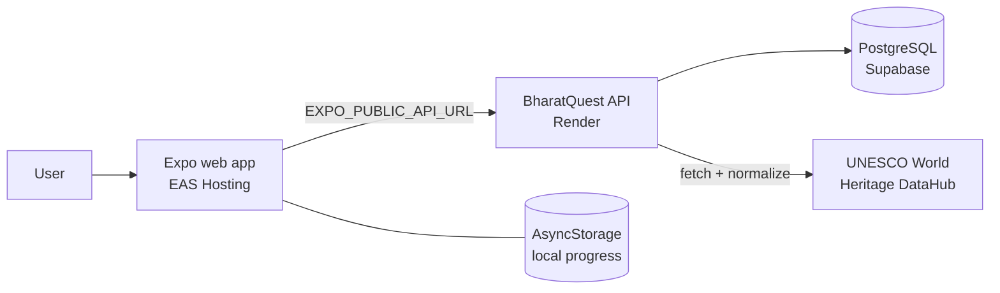

# BharatQuest 🇮🇳

### Explore India's World Heritage. Learn through play.

[](https://bharatquest.expo.app)
[](#license)
[](https://www.typescriptlang.org/)
[](https://expo.dev/)

**▶ Try it: [bharatquest.expo.app](https://bharatquest.expo.app)**

BharatQuest is an educational exploration game built around India's UNESCO World Heritage sites. Players discover sites, complete missions, take on map and matching challenges, and build up a collection, while every heritage fact on screen stays tied to its source.

The project follows one principle:

> **Make heritage exploration feel like a game without compromising the provenance of the facts.**

Heritage information comes from the [UNESCO World Heritage DataHub](https://data.unesco.org/). When source data is missing, BharatQuest leaves the gap rather than inventing a replacement fact.

BharatQuest is an independent project. It is not affiliated with, endorsed by, or certified by UNESCO.

<!--
## Screenshots

Add screenshots to the repository (for example under docs/screenshots/) and reference them here.
-->

---

## Contents

- [Features](#features)
- [How it fits together](#how-it-fits-together)
- [Data and provenance](#data-and-provenance)
- [Architecture](#architecture)
- [Tech stack](#tech-stack)
- [Project structure](#project-structure)
- [Getting started](#getting-started)
- [Environment variables](#environment-variables)
- [Web build and deployment](#web-build-and-deployment)
- [Privacy and location](#privacy-and-location)
- [Limitations](#limitations)
- [Roadmap](#roadmap)
- [Contributing](#contributing)
- [License](#license)

---

## Features

**Exploration**
- Browse UNESCO World Heritage sites in India, with search and regional filtering
- Site detail pages showing the UNESCO description, category, inscription year, criteria, coordinates, and image attribution where UNESCO provides it
- Optional **Near Me** view that uses device location to surface nearby sites
- A data-source page that documents where the information comes from

**Gameplay**
- **Missions** that guide progressive exploration
- **Map challenge** built on UNESCO coordinates
- **Heritage matching** mini-games
- **Daily challenge** with a once-per-day reward
- **XP, levels, streaks, discoveries, and achievements**
- **Collection progress** across the sites you have found

**Platform**
- Expo Router app that runs on the web (deployed) and is structured for native platforms
- Player progress saved locally on the device

---

## How it fits together

BharatQuest keeps two kinds of information strictly separate.

| Documentary data (from UNESCO) | Game layer (created by BharatQuest) |
| --- | --- |
| Site name, descriptions, region, category | XP and levels |
| Inscription year and criteria | Rarity |
| Coordinates | Missions and challenge scores |
| Image URL, author, copyright, caption | Streaks, achievements, collection progress |
| Component information | The illustrated game world (conceptual artwork) |

Only the left column is presented as heritage fact. The right column is game design, and the interface is built so the two are not confused. That lets the app be playful without turning game-generated numbers into historical claims.

---

## Data and provenance

**Source:** UNESCO World Heritage DataHub, dataset `whc001`.

The API retrieves the UNESCO records, filters them for the State Party **India**, normalizes the fields, and stores the most recent successful result in PostgreSQL. Every record the API returns identifies UNESCO as its source. During the current production deployment the dataset loaded **45 Indian UNESCO records**; that count reflects the data at load time and will follow UNESCO's own records.

### Normalization

UNESCO's published schema has changed shape in places. For example, `states_names` is currently a string and coordinates arrive as `[latitude, longitude]`. The heritage service normalizes these fields and tolerates both current and older shapes, so the client always receives a consistent record.

### Database-backed cache

The API can serve the last successfully retrieved dataset from PostgreSQL, so client requests do not depend on UNESCO being reachable every time. It is a straightforward fetch, normalize, and cache arrangement, not a distributed data pipeline.

---

## Architecture



The API is mounted under `/api`:

| Endpoint | Purpose |
| --- | --- |
| `GET /api/healthz` | Health check |
| `GET /api/heritage` | Heritage records |
| `GET /api/heritage/india` | Records for India |
| `GET /api/heritage/search` | Search |
| `GET /api/heritage/region/:region` | Filter by UNESCO region |
| `GET /api/heritage/:id` | A single record |

Production endpoints:

- Web app: https://bharatquest.expo.app
- API: https://bharatquest-api.onrender.com

---

## Tech stack

**App**
- Expo, React Native, React 19, and TypeScript, with Expo Router for navigation and React Native Web for the browser build
- TanStack React Query for server state
- AsyncStorage for persisted player progress
- Expo Location, Expo Image, Expo Linear Gradient, Expo Haptics, Expo Font, and Expo Web Browser
- Gesture Handler, Safe Area Context, Keyboard Controller, and React Native SVG
- Zod for validation

**API and data**
- Node.js and TypeScript, using Express 5
- PostgreSQL with Drizzle ORM
- Zod validation, with the API contract defined as an OpenAPI spec and client code generated by Orval
- esbuild for the server bundle

**Hosting**
- Expo EAS Hosting for the web app
- Render for the API
- Supabase for the production PostgreSQL database

Exact dependency versions are pinned in the workspace `package.json` files.

---

## Project structure

BharatQuest is a pnpm workspace, not a single Expo project.

```text
.
├── artifacts/
│   └── bharatquest/        # Expo / React Native app (also home to the API server package)
├── lib/                    # Shared workspace packages (API spec and generated client, database schema)
├── scripts/                # Workspace scripts
├── package.json            # Root scripts: build, typecheck, typecheck:libs
├── pnpm-workspace.yaml     # Workspace packages, dependency catalog, install policy
├── tsconfig.base.json
└── tsconfig.json
```

---

## Getting started

### Prerequisites

- Node.js 24
- [pnpm](https://pnpm.io/). The root `preinstall` script rejects npm and yarn, so use pnpm for everything.
- A PostgreSQL database for the API (local or hosted)

### Install

```bash
git clone https://github.com/antra-09120/BharatQuest.git
cd BharatQuest
pnpm install
```

### Run the API

Set `DATABASE_URL` (see [Environment variables](#environment-variables)), push the schema, then start the server:

```bash
pnpm --filter @workspace/db run push          # development only
pnpm --filter @workspace/api-server run dev   # listens on port 5000
```

### Run the app

```bash
cd artifacts/bharatquest
pnpm run dev
```

Point the app at your API with `EXPO_PUBLIC_API_URL`, or at the production API listed above.

### Checks

```bash
pnpm run typecheck   # typecheck libraries, apps, and scripts
pnpm run build       # typecheck, then build every package that defines a build script
```

The app package also exposes `build`, `serve`, and `typecheck` scripts.

---

## Environment variables

| Variable | Used by | Description |
| --- | --- | --- |
| `DATABASE_URL` | API | PostgreSQL connection string. Required. |
| `EXPO_PUBLIC_API_URL` | App | Base URL of the BharatQuest API. |
| `EXPO_PUBLIC_DOMAIN` | App | Read by the root layout as a fallback when the API URL is not set. |

Use placeholders in local configuration and never commit real credentials:

```bash
DATABASE_URL=<your-postgresql-connection-string>
EXPO_PUBLIC_API_URL=<your-api-base-url>
```

---

## Web build and deployment

The web app is exported with Expo and served through EAS Hosting.

```bash
cd artifacts/bharatquest
npx expo export --platform web     # writes the static site to dist/
npx eas-cli deploy --prod          # publishes dist/ to EAS Hosting
```

Set `EXPO_PUBLIC_API_URL` to the production API before exporting, since Expo inlines public variables at build time.

The API runs on Render and connects to Supabase PostgreSQL through `DATABASE_URL`. Because the API depends on workspace packages, its build has to run from the repository root rather than from the API folder alone.

---

## Privacy and location

- **Progress stays on your device.** Game state is stored locally with AsyncStorage.
- **Location is optional.** It is requested only for the Near Me feature, with this prompt: *"Allow BharatQuest to show heritage sites near your approximate location. Location is not saved."*
- **No accounts.** The app has no sign-in, cloud profile, or cloud sync.

---

## Limitations

- BharatQuest is an educational game and a prototype, not an official UNESCO product.
- Heritage content is limited to what the UNESCO DataHub publishes. The app does not add original historical material.
- Progress is tied to one device and browser; clearing local storage clears progress.
- The web app is the published build. There are no App Store or Google Play releases.
- The data layer depends on the shape of UNESCO's published dataset. The normalization layer absorbs known variations but cannot anticipate every future change.

---

## Roadmap

These are directions under consideration, not commitments or dated promises.

- Broader heritage content
- Additional challenge types and richer gameplay
- Deeper progression systems
- Accessibility improvements
- Further polish for native platforms

---

## Contributing

Issues and pull requests are welcome. Before opening a pull request, run `pnpm run typecheck` from the repository root. Changes that touch heritage data handling should keep the separation between UNESCO-sourced facts and game metadata intact.

---

## License

Released under the MIT License, as declared in the root `package.json`.

---

## Acknowledgements

Heritage data is provided by the [UNESCO World Heritage DataHub](https://data.unesco.org/). Image credits and copyright information shown in the app come from UNESCO's records.
